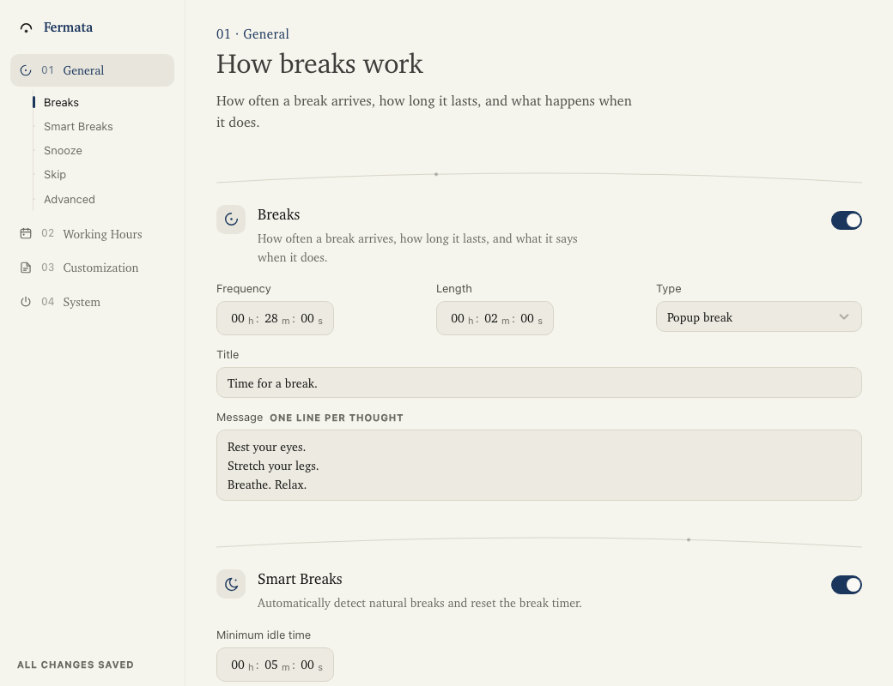
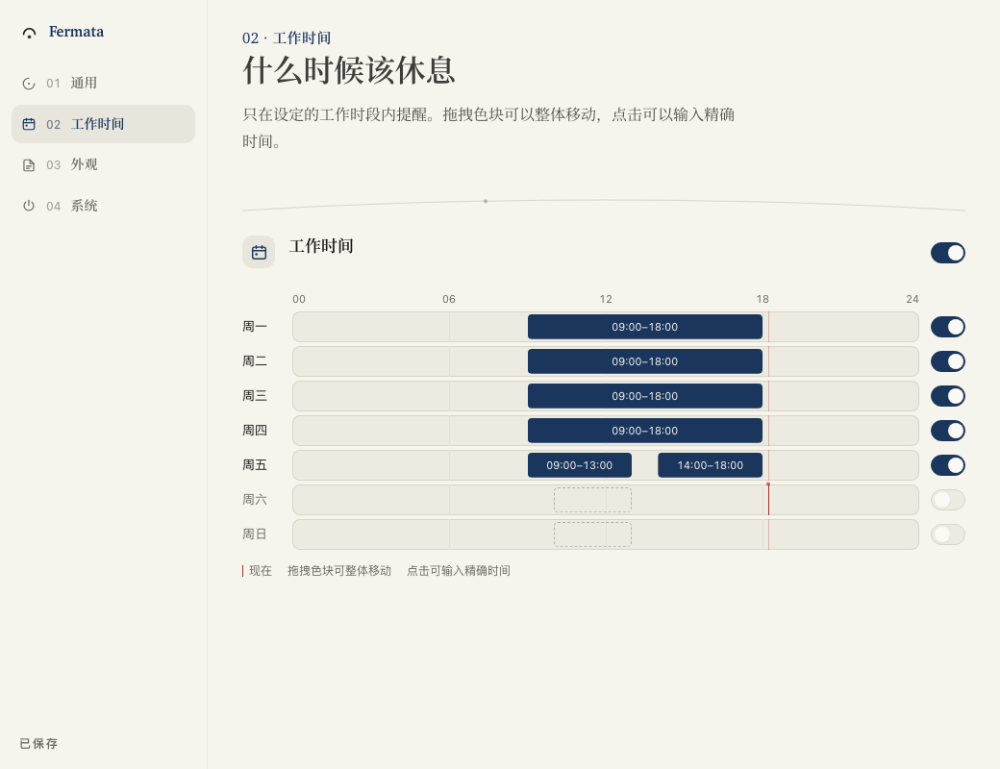
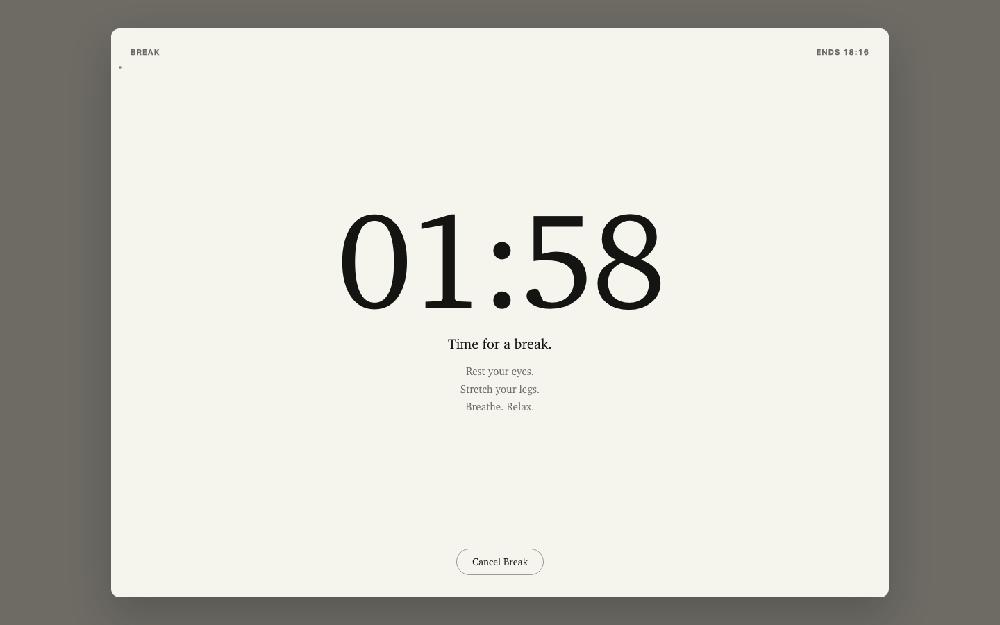

# Fermata

A fork of [BreakTimer](https://github.com/tom-james-watson/breaktimer-app) by
[tom-james-watson](https://github.com/tom-james-watson). The product is his; the
visual world, the week ledger and the Chinese translation are this fork's. See
[Licence and attribution](#licence-and-attribution) below.

## About this fork — Fermata

A **UI redesign of [BreakTimer](https://github.com/tom-james-watson/breaktimer-app)**,
renamed and re-drawn. The product — what it does, every setting, every
behaviour — is upstream's. What changed is the visual world, the two screens
that were hardest to use, and the fact that it now speaks Chinese.

The look is **Paper & Ink**, taken from [mole.fit](https://mole.fit) and the Tang
token set it shares with kami and luo: parchment and ink instead of grey chrome,
a serif that carries the content, hairlines instead of boxes, pills instead of
rectangles, near-zero elevation.

### The name

A **fermata** is the notation that means _hold this note longer than written,
then continue_. It is a break, written down. The mark is an arch over a dot,
which is also a clock — the arch is the sweep, the dot is where the hand is.



_Settings: a numbered index over sections separated by orbit arcs._

### What is actually different

- **The type has a scale now.** The reference runs 96 → 14 (a 7:1 span); the
  first two builds of this ran 23 → 11 and looked like a form with nice colours
  on it. There is now a 32px page head with a navy `01 · General` eyebrow and a
  16px lede, over 17px section titles.
- **Chinese ships with the app.** Noto Serif SC (which is Source Han Serif),
  subsetted, 11MB for two weights. Without it Chinese fell through to Songti SC
  — a print face at 13px, which is what made it look wrong — and on Windows there
  was no Chinese serif at all.
- **The serif stops at 14px.** Above it, serif; below, the system sans. That is
  the reference's own floor, confirmed by measuring what it renders.
- **Settings is a document, not a form.** 1040×800, two columns: a contents
  rail down the left (the four groups, and under the open one its sections as
  anchors with a scroll-spy), the page being read on the right. The content
  column lands at 752px, which takes the week ledger's 24-hour scale from 512px
  to 620px and gives every field row room to breathe.
- **Working Hours is a week ledger.** Seven rows on one shared 24-hour scale;
  drag a shift to move it, click one to type exact times. It replaces fourteen
  `09 : 00 h m` input groups you had to reconstruct an answer from.
- **The break screen puts the countdown first.** The remaining time is the
  largest thing on the sheet — 196px on a 1440×900 display — instead of a 14px
  label at the end of a progress bar.
- **Colour pickers became six named sheets.** The shipped default was a
  saturated teal, so every user's full-screen break was a different app. Custom
  remains, and it reports its own contrast ratio.
- **The notice is a slip of paper**, not a colour-filled card with a moving wipe
  travelling over the number you are trying to read.
- **Every icon is drawn here.** Nineteen glyphs on a 24 grid at stroke 1.8 with
  round caps, in three families: the arch-over-a-dot the mark is built from, the
  section seals, and a 16-grid set for small controls.
- **The page moves, slowly.** Sections ink in with a stagger; the week draws
  itself left to right, one day at a time; the mark rules its own arch on
  launch; today's row pulses at 3.4s; and a 4px star rides both the section
  dividers and the break sheet's progress rule. Nothing moves for longer than it
  takes to read what it is revealing.
- **Chinese, everywhere.** A language picker in Settings, full-width
  punctuation, and typography that sets differently — 1.75 leading, a 12px floor
  for Han labels, and `text-wrap: balance` switched off, because a balancer with
  no word spaces to break at will split a phrase mid-word.



_工作时间: one week ledger, one shared scale, and a red hairline for now._



_The break sheet: a page on a darkened desk, capped at 1120×820 so the
composition is the same on a 1440 display and a 3440 one._


_The notice: a slip at the top of each display, one minute before the break._

Read [DESIGN.md](DESIGN.md) for the system and [PRODUCT.md](PRODUCT.md) for what
future work has to preserve.

### Licence and attribution

Upstream BreakTimer is **GPL-3.0-or-later**, and this is a derivative work, so
it stays GPL-3.0-or-later: see [LICENSE.md](LICENSE.md). The copyright notices
and the attribution above are part of the licence. Credit for the product, its
name and everything it does belongs to
[tom-james-watson](https://github.com/tom-james-watson).

### Building for all three platforms

Upstream publishes by hand, from three machines — `DEVELOPMENT.md` says so. That
is why a fork ends up with "no Windows version": nobody is going to sit at a
Windows box every time the rail moves a pixel.

`.github/workflows/release.yml` builds **macOS (arm64), Windows (x64) and Linux
(x64)** on a `v*` tag or on demand, runs typecheck, tests, lint and
format-check on each before packaging, and attaches the artifacts to a **draft**
release. Run it from the Actions tab, or:

```bash
git tag v0.1.0 && git push --tags
```

On macOS you can also build locally:

```bash
npx electron-builder build --win --x64 --publish never   # needs winCodeSign + NSIS downloads
npx electron-builder build --linux --x64 --publish never
```

Windows-specific ground that has been checked: the window's 40px frame
compensation, a content height of 808px rather than 768, and 125% and 150% DPI
scaling — all three are cases in `verify-ui.mjs`. Windows is also why the serif
stack names SimSun (宋体) and MingLiU: without them, Chinese text on Windows
falls through to whatever generic `serif` resolves to, and Latin and Han end up
set from different families.

### Updates are off

The fork inherited upstream's GitHub release feed, so the first auto-update
check would have replaced Fermata with BreakTimer. `RELEASE_REPO` in
`app/main/index.ts` is `null` until you publish your own releases; set it there
and under `build.publish` in `package.json` to turn both the silent updater and
the Windows/Linux download link back on.

### Checking the UI

The sizes this app ships at — a 660px window, a 592×100 slip, a full-screen
sheet — cannot be reviewed by reading source, and the defects a redesign like
this hides best are invisible in a screenshot. So they are measured:

```bash
npm run build-renderer
node scripts/verify-ui.mjs --shot /tmp/fermata-shots
```

It renders seventeen surfaces in headless Chrome against a stubbed preload — both
languages, both themes, and a 3440×1440 display — and fails on horizontal
overflow, clipped content, text below the floor, contrast below the WCAG
minimum, any cool grey that leaked from the theme this replaced, and hit targets
under 20px. `--slow` adds the notice's countdown phase, which only exists a
minute in.

🔨 **Looking for contributors** 🔨 If you feel like getting involved, please get in contact!

BreakTimer is a desktop application for managing and enforcing periodic breaks. BreakTimer is available for Windows, macOS, and Linux.

BreakTimer allows you to customize:

- How long your breaks are and how often do you wish to have them
- Whether to be reminded with a simple notification or a fullscreen break window
- Working hours so you are only reminded when you want to be
- The content of messages shown during breaks.
- Whether to intelligently restart your break countdown when it detects that you have not been using the computer

We do not offer support for enterprise environments or commercial deployment. This software is provided ‘as is’ without any warranties or guarantees of support.

## Installation

- **Windows** - [BreakTimer.exe](https://github.com/tom-james-watson/breaktimer-app/releases/latest/download/BreakTimer.exe) (Unsigned - you will receive a warning on install, press more info -> run anyway. Will not auto-update)
- **macOS** - [BreakTimer.dmg](https://github.com/tom-james-watson/breaktimer-app/releases/latest/download/BreakTimer.dmg)
- **Linux**:
  - Auto-updating **[preferred]**:
    - [BreakTimer Snap](https://snapcraft.io/breaktimer) - **also available in the Ubuntu App Store**.
    - [BreakTimer.AppImage](https://github.com/tom-james-watson/breaktimer-app/releases/latest/download/BreakTimer.AppImage)
  - Non auto-updating
    - [BreakTimer.deb](https://github.com/tom-james-watson/breaktimer-app/releases/latest/download/BreakTimer.deb)
    - [BreakTimer.rpm](https://github.com/tom-james-watson/breaktimer-app/releases/latest/download/BreakTimer.rpm) (untested)
    - [BreakTimer.tar.gz](https://github.com/tom-james-watson/breaktimer-app/releases/latest/download/BreakTimer.tar.gz)

## FAQ

### Can I donate to BreakTimer?

Some of you have asked about being able to make a donation towards BreakTimer. That's incredibly generous, but I honestly have no need for monetary donations.

If you’d like to show your appreciation, consider donating to a charity of your choice instead. That way, the money goes where it’s really needed 🫶. If you do, I’d love to hear about it—feel free to email me at contact@breaktimer.app and let me know where you donated.

### Why can't I see the app in the tray?

Some operating systems, such as Linux distributions running plain Gnome (e.g. Fedora) or Pantheon (e.g. Elementary OS), don't support system tray icons. In this case, simply re-run the app to open the settings window. You will lose access to certain functionality only available in the tray menu, but at least this workaround lets you use the app.

### Is there a way to control the app via the command line?

On Linux, if you run the app via the command line there is some basic support for command line arguments:

Disable breaks:

```bash
breaktimer disable
```

Enable breaks:

```bash
breaktimer enable
```

### How can I pass you my log files to help you debug an issue?

You can find the log file for BreakTimer here:

Linux: `/home/<USERNAME>/.config/BreakTimer/logs/main.log`

macOS: `/Users/<USERNAME>/Library/Logs/BreakTimer/main.log`

Windows: `C:\Users\<USERNAME>\AppData\Roaming\BreakTimer\logs/main.log`

You can either upload this to a cloud service such as Dropbox or Google Drive and enable public sharing, or you can email the file as an attachment to contact@breaktimer.app. The log files do not contain any personally identifying information.

Please try and include a timestamp for roughly when you have seen the issue so that I can find the relevant place in the log file.

### How can I hard reset the app's data

In case a bug has left the UI in an unrecoverable state, you can reset the app data by exiting the app, deleting the below folder, and starting the app again.

Linux: `/home/<USERNAME>/.config/BreakTimer`

macOS: `/Users/<USERNAME>/Library/Application Support/BreakTimer`

Windows: `C:\Users\<USERNAME>\AppData\Roaming\BreakTimer`

## Development

See [./DEVELOPMENT.md](DEVELOPMENT.md).
